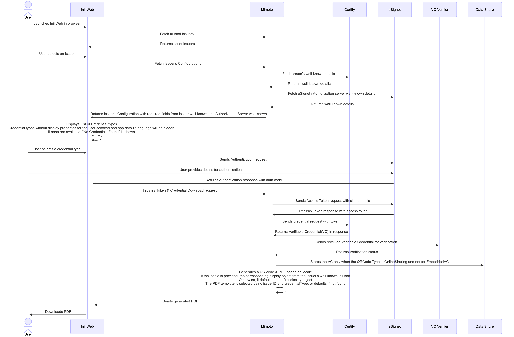

# **Understanding the workflow**

### **Inji Web IssuersPage**

- The users navigate to the Inji Web portal from their web browser.
- The portal features a user-friendly interface accessible to all.
- Inji Web Display the list of Issuers supported and sourced from [mimoto-issuers-configuration](https://github.com/mosip/mosip-config/blob/collab1/mimoto-issuers-config.json)

### **Selection of Issuer and credential type:**

- The users can select an Issuer from the list of trusted issuers
- On Clicking the issuer, user will be redirected to credential Types page, where user will be displayed with list of credentials supported by the selected issuer. For any Credential Type if Issuer well-known doesn't contain display properties for the user selected and app default language then it will not be displayed and if none of the Credential Type contains it then "No Credentials Found" is displayed in the UI.
- Credential Types of the selected Issuer are sourced from this mimoto endpoint **"/issuers/{issuer-id}/configuration"**. This includes the required fields of Issuer well-known and Authorization Server well-known.
- Mimoto will fetch the Issuers fields from Issuer's well-known **"/.well-known/openid-credential-issuer"** and Authorization Server fields from Authorization Server well-known **"/.well-known/oauth-authorization-server"**.
- The users can choose a credential type from the available options provided by the issuers.

**Sequence Diagram for the Inji Web is mentioned here**

### **Authorization**

- When the user selects any credential type, user is redirected to the authorization page for that specific issuer.
- Authorization server configurations such as authorize_endpoint and grant_types_supported are sourced from its wellknown **"/.well-known/oauth-authorization-server"** and if Authorization Server doesn't support required grnat types then Inji Web will show the error screen.
- If Authorization Server supports required grant types and authorization is successful then authorization server return the **"authorizationCode"**.
- Inji Web Send the authorization Code to authorization Server through Mimoto to perform the client assertions.
- Once Authorized, Authorization Server issues Token response, which include **access_token**.
- The "access_token" will be used to download the credential through VCI.

### **VC Issuance**

- Inji Web Send the access token to Mimoto.
- Mimoto generates a keypair and signs the credential Request and invokes the VCI endpoint to the issuer's server.
- Then Mimoto Gets the credential back.

### **PDF Download**

- Mimoto generates the PDF by applying the downloaded credential data to the Credential Template. It fetches the Credential Template file using the issuerId and credentialType, with the file name being in the format "issuerId-credentialType-template.html." If this file does not exist, it falls back to the default Credential Template file (https://github.com/mosip/mosip-config/blob/collab1/credential-template.html).
- It applies the Issuer's well-known display properties based on the received locale value to adjust the template text and background color. If a locale is provided, it uses the corresponding display object from the Issuer's well-known otherwise, it selects the first display object that includes a locale.
- It also uses order field in wellknown to render the fields in the same order.

### **Supported QR Codes**

- Mimoto Currently Supports Two Different QR Codes
  - EmbeddedVC -> uses Pixel pass library to embed the complete VC within the QR
  - OnlineSharing -> QR Contains a authorize endpoint, which validates the VP and redirects the VP token to the caller.
- Mimoto can toggle the issuers QR using the QR Code Type in the [mimoto-issuers-config.json](https://github.com/mosip/inji-config/blob/31704e5a31775551f535f74b3f9baad587468b79/mimoto-issuers-config.json#L105)
- Mimoto authorizes the verifiers using [mimoto-trusted-verifiers.json](https://github.com/mosip/inji-config/blob/release-0.3.x/mimoto-trusted-verifiers.json) as the source of truth

### **Online Sharing**

- Mimoto now has the ability for Share the credential online.
- Mimoto Stores the Credentials in the Datashare Service, and uses the resource link the QR Code along with the VP request. 
- When Verifier Scans the OVPRequest QR, The verifier is taken to mimoto through injiweb and performs the authorization using the mimoto-trusted-verifiers.json.
- Then redirects the VP token to the verifier through 302 Redirect. 
