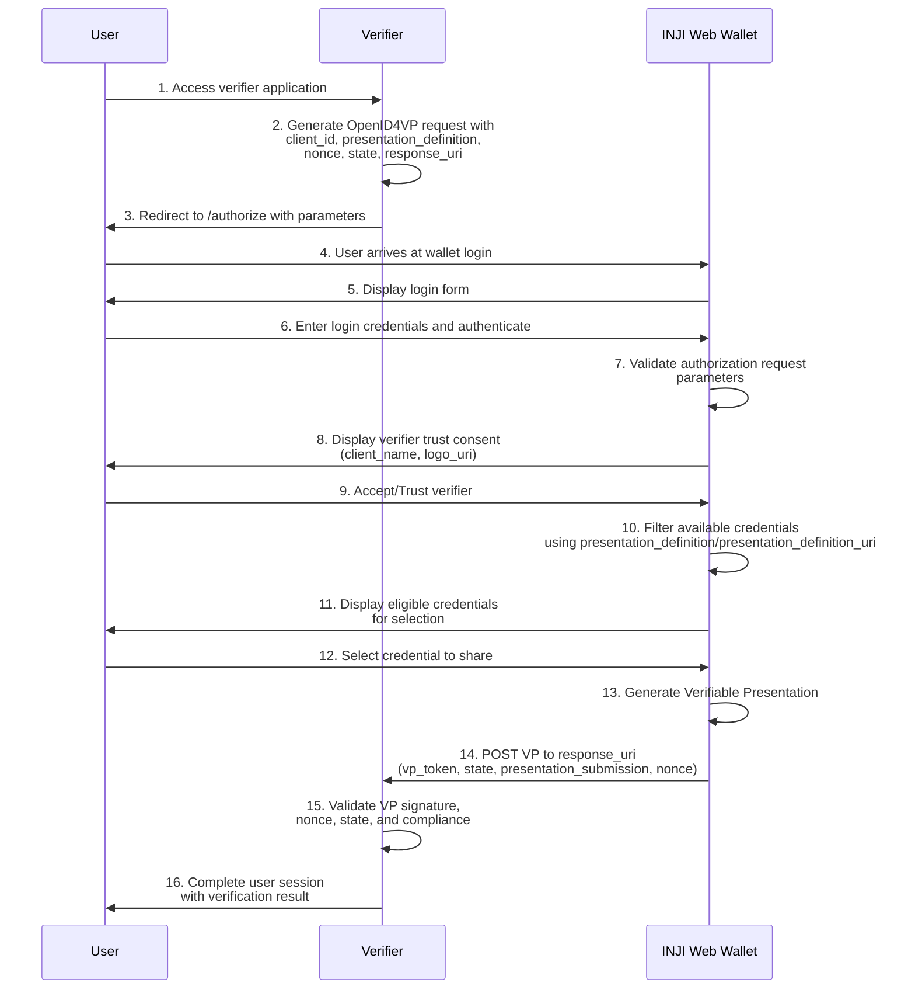
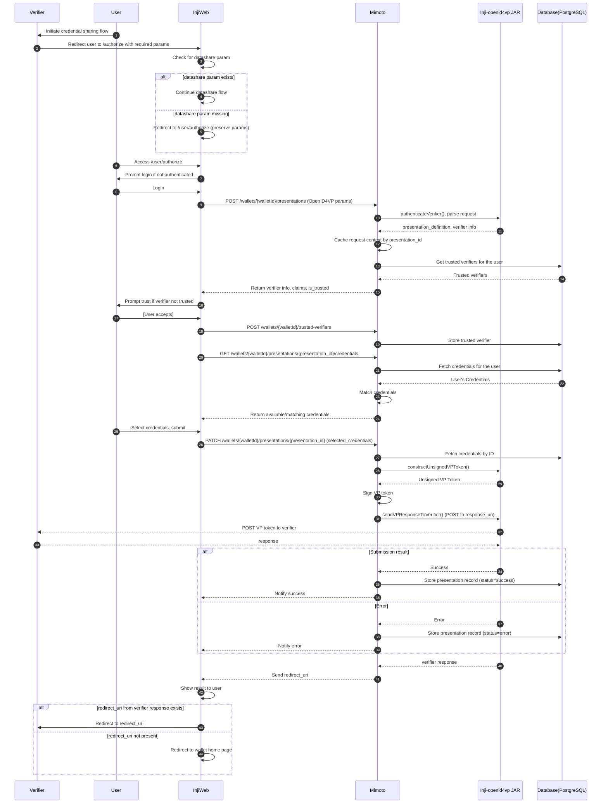
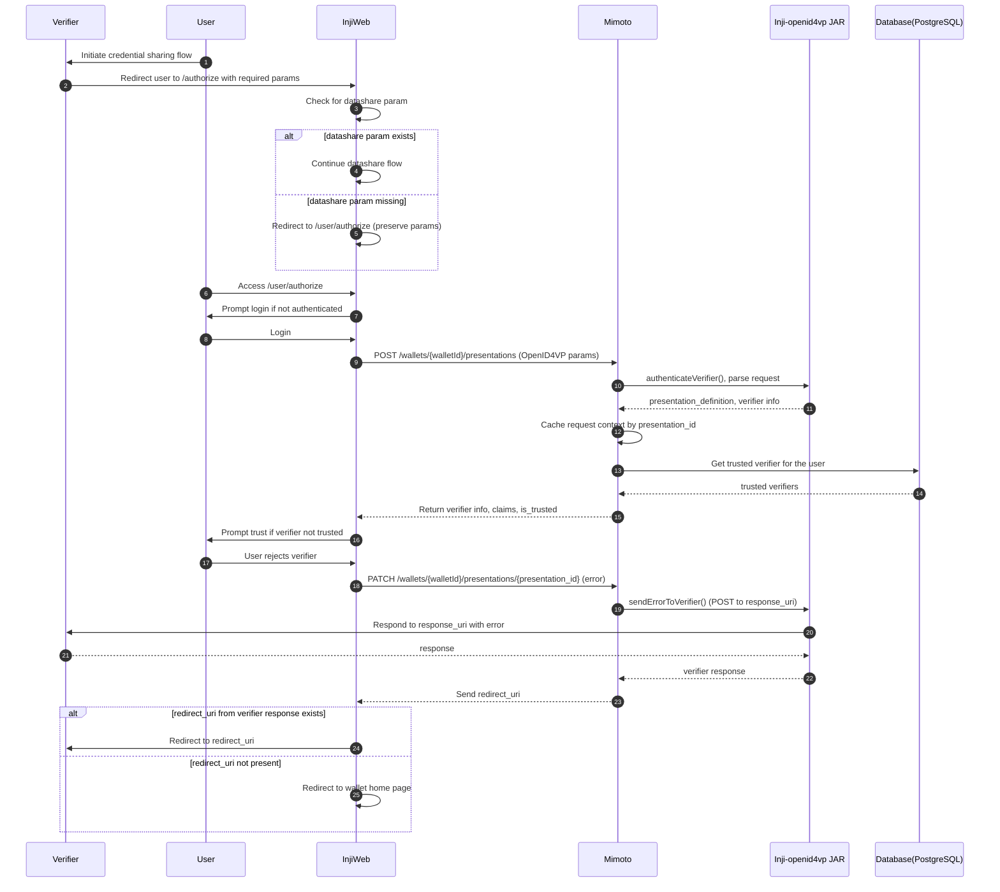

# Integrator’s Guide – Web Wallet Login & VC Sharing (OpenID4VP)

## 1. Introduction
This guide provides implementers (*Verifiers*) with all necessary information to integrate their systems with the **INJI Web Wallet**. The integration enables users to log into the web wallet and share Verifiable Credentials (VCs) via **OpenID for Verifiable Presentations (OpenID4VP)**.

**Supported Credential Formats**: The INJI Web Wallet currently supports only **JSON-LD Verifiable Credentials** based on the W3C Verifiable Credentials Data Model 1.1. Other formats like JSON-LD Data Model 2.0, SD-JWT, MSO mDocs, etc. are not supported at this time.

The verifier initiates the flow by redirecting the user to the wallet with the required OpenID4VP parameters. The wallet authenticates the user, requests consent, enables credential selection, and returns a Verifiable Presentation (VP) back to the verifier via the provided API endpoint.

## 2. High-Level Flow
1. Verifier constructs an OpenID4VP authorization request.
2. User is redirected to the INJI Web Wallet (`/authorize`).
3. User logs in.
4. User reviews verifier details and gives consent.
5. User selects an eligible credential matching the `presentation_definition`.
6. Wallet generates a Verifiable Presentation.
7. Wallet sends the VP back to the verifier's `response_uri`.

### Sequence Diagram



## 3. Authorization Endpoint
All verifier integrations begin by redirecting the user to:

```bash
https://example.injiweb.com/authorize
```

### Required URL Parameters

| Parameter | Required | Description |
|----------|----------|-------------|
| `client_id` | Yes | Identifier for the verifier. Interpretation depends on `client_id_scheme`. |
| `client_id_scheme` | Optional | Supported values: `redirect_uri`, `pre-registered`, `did`. If not provided, the wallet interpret it based on the value in `client_id` field |
| `presentation_definition` or `presentation_definition_uri` | Yes | URL-encoded Presentation Exchange definition used to specify credential requirements or URL of the presentation definition object. Either of them are mandatory. |
| `response_type` | Yes | Must be `vp_token`. |
| `response_mode` | Yes | Must be `direct_post` or `direct_post.jwt`. |
| `nonce` | Yes | Cryptographically secure random value for replay protection. |
| `state` | Yes | Opaque value maintained across request/response. |
| `response_uri` | Yes | HTTPS endpoint at the verifier that receives the VP. |
| `client_metadata` | No | URL-encoded metadata that describes verifier branding and supported formats. |

## 4. Supported `client_id_scheme` Values

### 4.1 `redirect_uri`
- No prior registration needed.
- Wallet identifies the verifier based on the redirect URI domain.

### 4.2 `pre-registered`
- `client_id` and metadata must be pre-registered with the wallet operator.
- Example:  
  ```bash
  client_id=sample-app
  client_id_scheme=pre-registered
  ```

### 4.3 `did`
- `client_id` is a DID.
- Wallet resolves the DID document to verify authenticity and keys.

## 5. Presentation Definition
The `presentation_definition` parameter defines what credential the verifier is requesting and must follow the **Presentation Exchange** specification.

### Example Presentation Definition (decoded)

```json
{
  "id": "c4822b58-7fb4-454e-b827-f8758fe27f9a",
  "purpose": "Relying party is requesting your digital ID for the purpose of Self-Authentication",
  "format": {
    "ldp_vc": {
      "proof_type": ["Ed25519Signature2020"]
    }
  },
  "input_descriptors": [
    {
      "id": "id card credential",
      "format": {
        "ldp_vc": {
          "proof_type": ["RsaSignature2018"]
        }
      },
      "constraints": {
        "fields": [
          {
            "path": ["$.type"],
            "filter": {
              "type": "object",
              "pattern": "MOSIPVerifiableCredential"
            }
          }
        ]
      }
    }
  ]
}
```

## 6. Client Metadata
Client metadata provides verifier branding information (such as name and logo) displayed during the consent step, along with the supported VP formats and proof types the verifier can process.

### Example (decoded)

```json
{
  "client_name": "Sample Application",
  "logo_uri": "https://mosip.github.io/inji-config/logos/StayProtectedInsurance.png",
  "vp_formats": {
    "ldp_vp": {
      "proof_type": [
        "Ed25519Signature2018",
        "Ed25519Signature2020",
        "RsaSignature2018"
      ]
    }
  }
}
```

## 7. Sample Complete Authorization Request

```bash
https://example.injiweb.com/authorize
  ?client_id=sample-app
  &client_id_scheme=pre-registered
  &presentation_definition=<URL-ENCODED JSON>
  &response_type=vp_token
  &response_mode=direct_post
  &nonce=T8L8YdEg/cBkKSB1m0QoBw==
  &state=req_68af3c2d-6424-44ee-b3f8-01585e487d6c
  &response_uri=https://verifier.example.com/vp-submission
  &client_metadata=<URL-ENCODED JSON>
```

## 8. User Experience in the Wallet

### 8.1 Login
User logs into the wallet using their credentials.

### 8.2 Verifier Trust Consent
The wallet displays:
- `client_name`
- `logo_uri`

### 8.3 Credential Selection
Wallet automatically filters available credentials using:
- `presentation_definition.format`
- `input_descriptors`
- Field constraints

### 8.4 VP Generation
Wallet creates a Verifiable Presentation using supported proof types.

### 8.5 VP Submission
Wallet sends the VP to the verifier’s `response_uri` endpoint.

## 9. VP Delivery 

### POST Request Format
Wallet POSTs form-encoded data to the `response_uri`.

### 9.1 For response_mode `direct_post`

### POST Body Fields

| Field | Description |
|-------|-------------|
| `vp_token` | The Verifiable Presentation (JWT or JSON-LD). |
| `state` | Same value received in the authorization request. |
| `presentation_submission` | Describes mapping of credentials in VP to their corresponding input_descriptors in the `presentation_definition` or `presentation_definition_uri` param |


### Example (URL decoded)

```bash
POST /vp-submission
Content-Type: application/x-www-form-urlencoded

vp_token=<base64url_vp>
state=req_68af3c2d-6424-44ee-b3f8-01585e487d6c
"presentation_submission": {
    "id": "urn:uuid:b315f683-5ba5-4813-a00c-ef9cd637860a",
    "definition_id": "vp token example",
    "descriptor_map": [
      {
        "id": "d7a78782-d93f-4b0a-80a2-5fe22b54ac76",
        "format": "ldp_vp",
        "path": "$",
        "path_nested": {
          "id": "d7a78782-d93f-4b0a-80a2-5fe22b54ac76",
          "format": "ldp_vc",
          "path": "$.verifiableCredential[0]"
        }
      }
    ]
  }
```

### 9.2 For response_mode `direct_post.jwt`

### POST Body Fields (JWT)

| Field | Description |
|-------|-------------|
| `response` | The Verifiable Presentation in JWT format, containing vp_token, presentation_submission and state in the payload.  |

### Example

```bash
POST /vp-submission
Content-Type: application/x-www-form-urlencoded

response=<Verifiable Presentation in JWT format>
```

## 10. Security Considerations

### Nonce Validation
Verifier must ensure:
- VP contains the same nonce
- Nonce is unexpired
- Nonce is single-use

### State Validation
Verifier must validate `state` to correlate response with the correct session.

## 11. Integration Steps for Verifiers

1. Choose your `client_id_scheme`.
2. Prepare a valid `presentation_definition`.
3. Prepare a `client_metadata` object.
4. Generate `state` and `nonce`.
5. Implement a secure `response_uri` endpoint.
6. Redirect user to the `/authorize` endpoint with all parameters.
7. Receive VP via direct POST.
8. Validate:
   - VP signature  
   - Credential format  
   - Nonce and state  
   - Presentation definition compliance  
9. Perform your internal verification and decisioning.

## 12. Error Handling

Possible errors:

| Error code | Reason |
|-------|-------------|
| `invalid_request` | Invalid or missing parameters |
| `invalid_presentation_definition_uri` | Presentation definition URI not reachable |
| `access_denied` | User cancelled, matching credentials not found or denied consent |

The above error codes are not exhaustive list but the most common ones, please refer the OpenID for VP Draft 23 specification for all possible scenarios and errors : [OpenID4VP Draft 23 - Error codes and description](https://openid.net/specs/openid-4-verifiable-presentations-1_0-ID3.html#name-error-response)

Sample Error : 

```json
{
  "error": "access_denied",
  "error_description": "User denied authorization to share credentials",
  "state": "K5J1chFRHMAbbT90FxUq2Q=="
}
```


## 13. Technical Specification

* **Key actors:** Verifier, User, INJI Web (wallet UI), Mimoto (wallet backend), Inji-openid4vp JAR, PostgreSQL Database.
* The **Verifier** redirects the **User** to INJI Web’s **/authorize** endpoint with OpenID4VP parameters.
* **INJI Web** handles login, database-param checks, and trust prompts, then calls Mimoto’s wallet APIs.
* **Mimoto** receives the request through **POST /wallets/{walletId}/presentations**, validates the verifier, and caches the presentation context.
* INJI Web fetches credential options via **GET /wallets/{walletId}/presentations/{presentationId}/credentials**.
* When the user submits, InjiWeb calls **PATCH /wallets/{walletId}/presentations/{presentationId}** with selected credentials.
* **Mimoto** constructs and signs the VP token, then sends it to the verifier’s **response_uri**.
* Mimoto stores success/error status in the **Database** based on the verifier’s response.
* If the user rejects, InjiWeb issues a PATCH error update, and Mimoto notifies the verifier accordingly.


### Detailed Integration Flow



### User Rejects Verifier Flow


## References

- [OpenID for Verifiable Presentations - draft 23](https://openid.net/specs/openid-4-verifiable-presentations-1_0-ID3.html)
- [INJI OpenID4VP jar ReadMe](https://github.com/mosip/inji-openid4vp/blob/master/README.md)
- [Mimoto API Documentation](https://mosip.stoplight.io/docs/mimoto)
