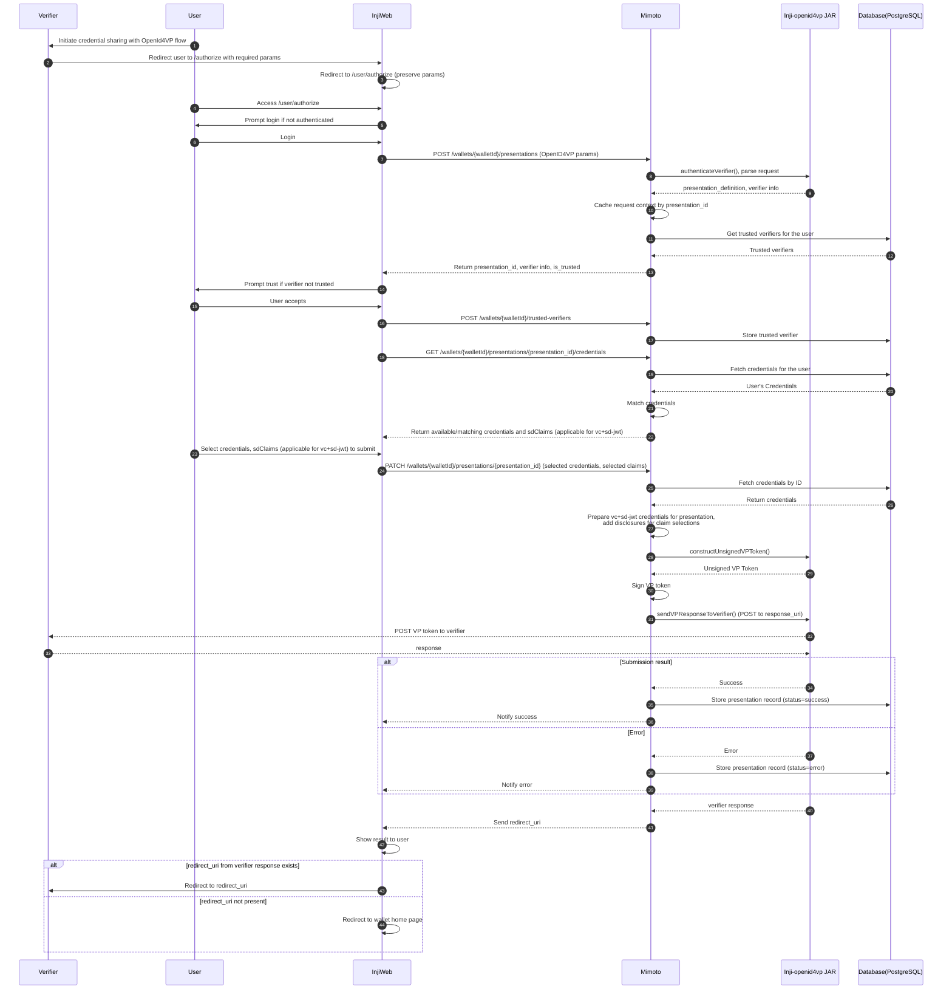

# OpenId4VP support for IETF SD-JWT credential formats (vc+sd-jwt and dc+sd-jwt)

The existing OpenID4VP flow in Inji Web wallet supports only W3C Data Model 1.1 JSON-LD VCs. This document provides further extension to the capability of Inji Web to share IETF SD-JWT VCs also.

### Technical Specification :

* **Key actors:** Verifier, User, INJI Web (wallet UI), Mimoto (wallet backend), Inji-openid4vp JAR, PostgreSQL Database.
* The **Verifier** redirects the **User** to INJI Web’s **/authorize** endpoint with OpenID4VP request.
* **INJI Web** handles user login, if the user is not logged in already. Post login, user will be asked to trust the verifier to proceed or cancel the flow. All these are handled through Mimoto APIs.
* **Mimoto** receives the request through **POST /wallets/{walletId}/presentations**, validates the verifier, and caches the presentation context.
* INJI Web fetches matching credentials via **GET /wallets/{walletId}/presentations/{presentationId}/credentials**.
* When the user submits, InjiWeb makes an API call - **PATCH /wallets/{walletId}/presentations/{presentationId}** with selected credentials.
* **Mimoto** uses OpenId4VP Jar to construct VP token. Post that signs the VP token, then sends it to the verifier’s **response_uri**. 
* Mimoto stores success/error status in the **Database** based on the verifier’s response.
* If the user rejects, InjiWeb issues a PATCH error update, and Mimoto notifies the verifier accordingly.


### Detailed Integration Flow



## Changes required to support SD-JWT credential sharing:

### Step 20 : Credential Matching

`GET /wallets/{walletId}/presentations/{presentation_id}/credentials`

- Support parsing of SD-JWT credentials and matching against input_descriptors.
- Use Authlete library to parse the sd-jwt VC, reference code already present in the `CredentialPDFGeneratorService` class.
- No proof type validation required for the vc+sd-jwt format.
- If sd-jwt_alg_values field is present in `input_descriptors -> format -> vc+sd-jwt -> sd-jwt_alg_values` , validate if VC's `alg` header is present in it during matching.
- New **optional** field `sdClaims` to be returned for vc+sd-jwt format credential :

  ```json
  {
    "availableCredentials": [
      {
        "credentialId": "cred-123",
        "credentialTypeDisplayName": "W3C VC",
        "credentialTypeLogo": "https://mosip.github.io/inji-config/logos/mosipid-logo.png",
        "format": "ldp_vc"
      },
      {
        "credentialId": "cred-1234",
        "credentialTypeDisplayName": "SD-JWT VC",
        "credentialTypeLogo": "https://mosip.github.io/inji-config/logos/mosipid-logo.png",
        "format": "vc+sd-jwt",
        "sdClaims": ["name", "age", "gender"]
      }
    ],
    "missingClaims": [
      "$.type"
    ]
  }
  ```

  **Note:** `sdClaims` will hold disclosures available in the sd-jwt.

#### Step 25 : Selection of credentials and submission

- The user will select the credentials to share from the UI (Inji web), for vc+sd-jwt they will get an additional prompt to select the disclosure claims too to share. The credential IDs and corresponding claims will be sent to mimoto endpoint for submission.


#### Step 26 - 32 : Submission of credentials to Verifier

`PATCH /wallets/{walletId}/presentations/{presentation_id}`

- Accept optional selected credentials list as input along with selected sdClaims for vc+sd-jwt credentials. New optional field `selectedSdClaims` introduced to accept selected sdClaims :

  ```json
  {
    "selectedCredentials": ["cred-123", "cred-456"],
    "selectedSdClaims": {
      "cred-123": ["name", "age"]
    }
  }
  ```
- For vc+sd-jwt credentials, match the corresponding claims from `selectedSdClaims` and keep only those disclosures in the final VP.
- Generate unsigned VP token using the Inji OpenID4VP library
- Add capability to sign VP token for sd-jwt credentials :
  1. The _inji-openid4vp_ library returns header and payload as unsignedVPToken to create signature. It returns a map of credential format and unsigned VP Token data to the Wallet to create signature

      ```
      for vc+sd-jwt and dc+sd-jwt format
      {
          "vc+sd-jwt": {
              "uuid": "<header>.<payload>"
          },
          "dc+sd-jwt": {
            "uuid": "<header>.<payload>"
          }
      }

      Note:
      - It returns header and payload to create signature for Key binding.
      - uuid is being used to map the signature returned from wallet to the respective sd-jwt vc
      ```
  2. The Wallet creates a signature for key binding using the provided header and payload for each sd-jwt format credential. It extracts `alg` from the provided header and use that algorithm to create signature.
  3. The wallet shares key binding signature with the _inji-openid4vp_ library.
  4. The _inji-openid4vp_ library attaches the signature to already created unsigned VP token.

## References:

- [OpenID for Verifiable Presentations - draft 23](https://openid.net/specs/openid-4-verifiable-presentations-1_0-ID3.html)
- [INJI OpenID4VP jar ReadMe](https://github.com/mosip/inji-openid4vp/blob/master/README.md)
- [Mimoto API Documentation](https://mosip.stoplight.io/docs/mimoto)
