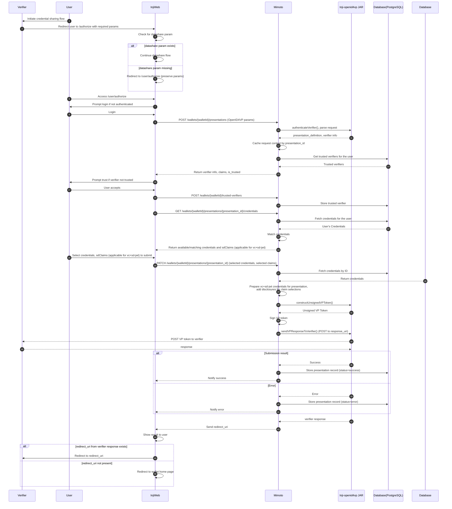

# Inji Web Wallet : SD-JWT Verifiable Credential Sharing (OpenID4VP)

The existing OpenID4VP flow in Inji Web wallet supports only W3C Data Model 1.1 JSON-LD VCs. This document provides further extension to the capability of Inji Web to share SD-JWT VCs also.

## 13. Technical Specification

* **Key actors:** Verifier, User, INJI Web (wallet UI), Mimoto (wallet backend), Inji-openid4vp JAR, PostgreSQL Database.
* The **Verifier** redirects the **User** to INJI Web’s **/authorize** endpoint with OpenID4VP parameters.
* **INJI Web** handles login, datashare-param checks, and trust prompts, then calls Mimoto’s wallet APIs.
* **Mimoto** receives the request through **POST /wallets/{walletId}/presentations**, validates the verifier, and caches the presentation context.
* INJI Web fetches credential options via **GET /wallets/{walletId}/presentations/{presentationId}/credentials**.
* When the user submits, InjiWeb calls **PATCH /wallets/{walletId}/presentations/{presentationId}** with selected credentials.
* **Mimoto** constructs and signs the VP token, then sends it to the verifier’s **response_uri**.
* Mimoto stores success/error status in the **Database** based on the verifier’s response.
* If the user rejects, InjiWeb issues a PATCH error update, and Mimoto notifies the verifier accordingly.


### Detailed Integration Flow



## Changes required to support SD-JWT credential sharing 

#### Step 20 : Credential Matching

`GET /wallets/{walletId}/presentations/{presentation_id}/credentials`

- Support parsing of SD-JWT credentials and matching against input_descriptors.
- Use Authlete library to parse the sd-jwt VC, reference code already present in the `CredentialPDFGeneratorService` class.
- No proof type validation required for the vc+sd-jwt format.
- If sd-jwt_alg_values field is present in `input_descriptors -> format -> vc+sd-jwt -> sd-jwt_alg_values` , validate if VC's `alg` header is present in it during matching. Reference code from mobile wallet : [alg validation](https://github.com/mosip/inji-wallet/blob/d67a6054ed45b07710bc1bea621aa4566b4a6fad/machines/openID4VP/openID4VPActions.ts#L372)
- New **optional** field `sdClaims` to be returned for vc+sd-jwt format credential :

  ```json
  {
    "availableCredentials": [
      {
        "credentialId": "cred-123",
        "credentialTypeDisplayName": "W3C VC",
        "credentialTypeLogo": "https://mosip.github.io/inji-config/logos/mosipid-logo.png",
        "format": "ldp_vc"
      },
      {
        "credentialId": "cred-1234",
        "credentialTypeDisplayName": "SD-JWT VC",
        "credentialTypeLogo": "https://mosip.github.io/inji-config/logos/mosipid-logo.png",
        "format": "vc+sd-jwt",
        "sdClaims": ["name", "age", "gender"]
      }
    ],
    "missingClaims": [
      "$.type"
    ]
  }
  ```

  **Note:** `sdClaims` will hold disclosures available in the sd-jwt VC.

#### Step 25 : Selection of credentials and submission

- The user will select the credentials to share from the UI (Inji web), for vc+sd-jwt they will get an additional prompt to select the disclosure claims too to share. The credential IDs and corresponding claims will be sent to mimoto endpoint for submission.


#### Step 26 - 32 : Submission of credentials to Verifier

`PATCH /wallets/{walletId}/presentations/{presentation_id}`

- Accept selected credentials list as input along with selected sdClaims for vc+sd-jwt credentials. New optional field `selectedSdClaims` introduced to accept selected sdClaims :

  ```json
  {
    "selectedCredentials": ["cred-123", "cred-456"],
    "selectedSdClaims": {
      "cred-123": ["name", "age"]
    }
  }
  ```
- For vc+sd-jwt credentials, match the corresponding claims from `selectedSdClaims` and keep only those disclosures in the final VC.
- Generate unsigned VP token using the Inji OpenID4VP library
- Add capability to sign VP token for sd-jwt credentials, reference code : [Mobile Wallet sd-jwt signing logic](https://github.com/mosip/inji-wallet/blob/d67a6054ed45b07710bc1bea621aa4566b4a6fad/machines/openID4VP/openID4VPServices.ts#L84)

## References

- [OpenID for Verifiable Presentations - draft 23](https://openid.net/specs/openid-4-verifiable-presentations-1_0-ID3.html)
- [INJI OpenID4VP jar ReadMe](https://github.com/mosip/inji-openid4vp/blob/master/README.md)
- [Mimoto API Documentation](https://mosip.stoplight.io/docs/mimoto)
