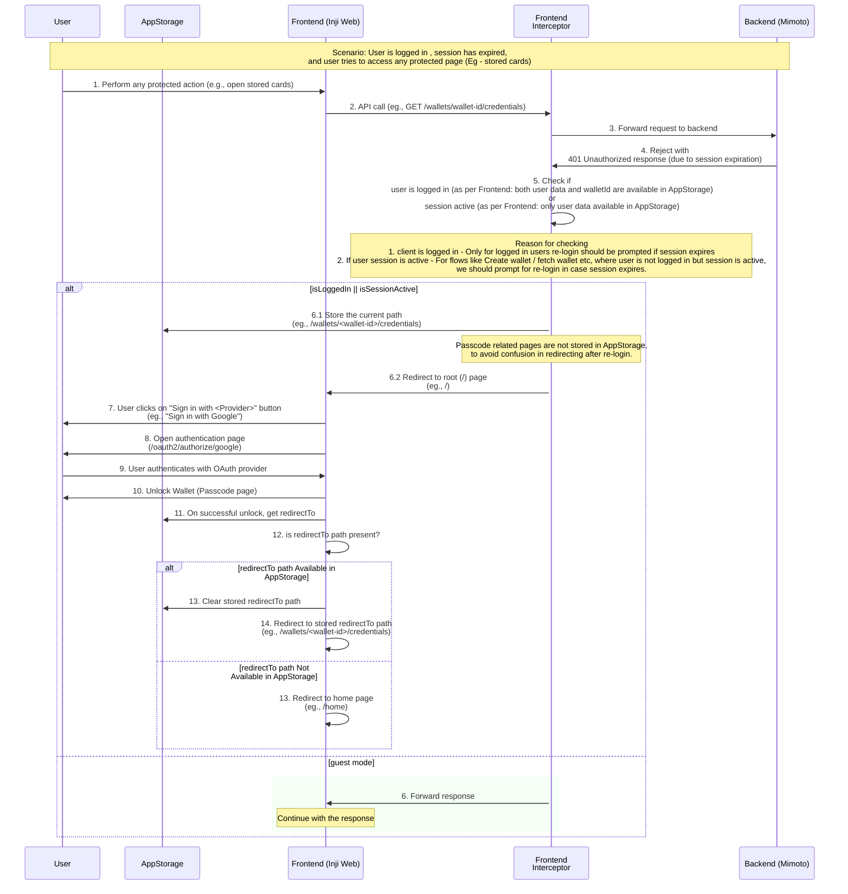

# Handling of User session expiration and re-authentication in Inji Web

## Overview

In case of the scenario where the logged-in user's session has expired, and the user tries to perform an action that requires authentication. User is required to re-login again to continue.

## Flow of User session expiration and re-authentication


In an expired session when user tries to perform an action that requires authentication, 
the frontend will receive a 401 Unauthorized response from the backend. 
The frontend will then redirect the user to the root page, where they can re-authenticate by clicking `Login with *`. To capture this for multiple actions, an interceptor is used to handle the 401 Unauthorized response and redirect the user to login again.

## Storing of current page url in AppStorage

When the user is asked for re-login due to session expiry while performing any authenticated action, the current page URL (or the page they were trying to access) is stored in the AppStorage (session storage). This allows the application to redirect the user back to that page after successful authentication.

##### Why Session Storage ?
- Session storage is a web storage mechanism that allows you to store data for the duration of the page session.
- Its lifecycle is tied to the browser tab, meaning it persists as long as the tab is open. And its persistent across page reloads and restores.
- It is accessible only within the same tab and not shared across tabs or windows.

## Technical Sequence Diagram

Actors involved:
1. **User** - The end user interacting with the application.
2. **AppStorage** - Manages session storage & local storage for the application.
3. **Frontend** (Inji Web) - The user interface that interacts with the backend.
4. **Frontend Interceptor** - Intercepts API calls and handles session management.
5. **Backend** (Mimoto) - Handles API requests and responses.



### Key Definitions

```
Logged-in user = Authentication via Provider (session active) + Unlocked wallet using Passcode.
```

- **isLoggedIn**: A boolean flag indicating whether the user logged in, tracked in frontend.
- **isSessionActive**: A boolean flag indicating whether the user session is active, tracked in frontend.
- **redirectTo**: A string representing the URL to redirect the user after successful authentication, stored in AppStorage(session storage).

### Whys
- **Why store the current page URL in AppStorage?**
  - To ensure that after re-login, the user is redirected back to the page they were trying to access before the session expired.
  - This improves user experience by minimizing disruption and allowing users to continue their workflow seamlessly.
- **Why passcode related pages (passcode and reset-passcode page) are not stored in AppStorage for redirecting post re-login**
  - To avoid confusion in redirecting the user back to the passcode page after re-login.
  -  This prevents unnecessary loops where users are repeatedly prompted for their passcode.
  - _Example scenario if not handled:_
    - User tries to login to Inji Web.
    - User authenticates via Provider and navigates to a passcode page. 
    - Session expires; user receives a 401 Unauthorized. 
    - User is redirected to login , where user re-initiates the login flow (authentication via Provider + unlock wallet by entering passcode).
    - After login, user is redirected back to the passcode page and asked to enter and submit passcode again. 