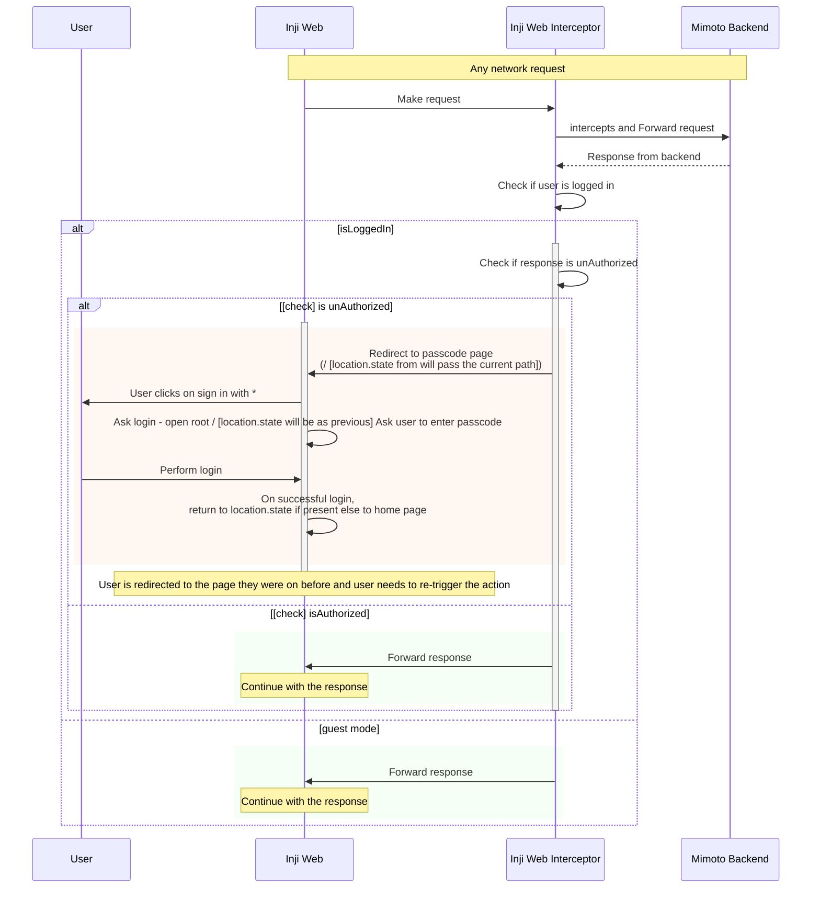
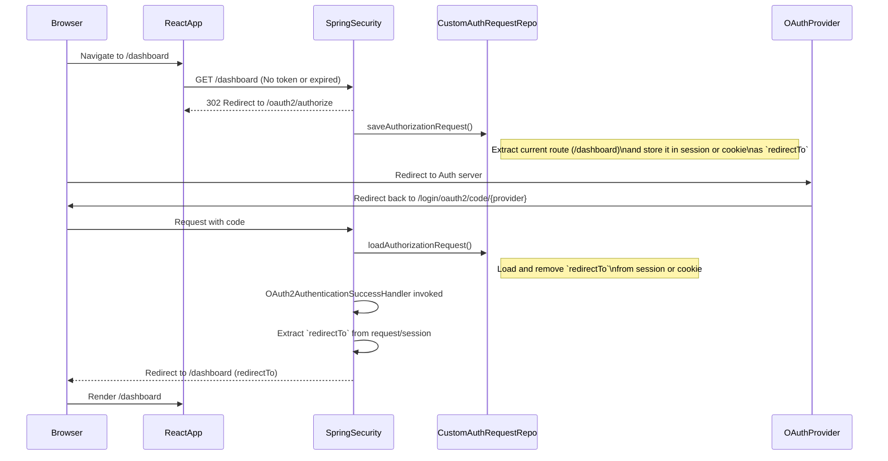
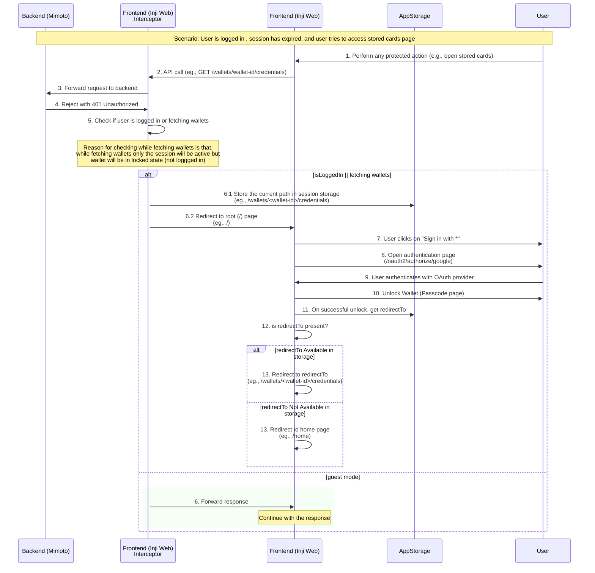

# Handling of User session expiration and re-authentication in Inji Web

## Overview

In case of the scenario where the logged in user's session has expired, and the user tries to perform an action that requires authentication. User is required to re-login again to continue.

## Flow of User session expiration and re-authentication

When an expired user tries to perform an action that requires authentication, 
the frontend will receive a 401 Unauthorized response from the backend. 
The frontend will then redirect the user to the passcode page, where they can re-authenticate. To capture this for multiple actions, an interceptor is used to handle the 401 Unauthorized response and redirect the user to login again.

### Technical Sequence Diagram

## Storing of previous page url in session

When the user is asked for re-login due to session expiry while performing any authenticated action, the current page URL (or the page they were trying to access) is stored in the session storage. This allows the application to redirect the user back to that page after successful authentication.

##### Why Session Storage
- Session storage is a web storage mechanism that allows you to store data for the duration of the page session.
- Its lifecycle is tied to the browser tab, meaning it persists as long as the tab is open. And its persistent across page reloads and restores.
- It is accessible only within the same tab and not shared across tabs or windows.

