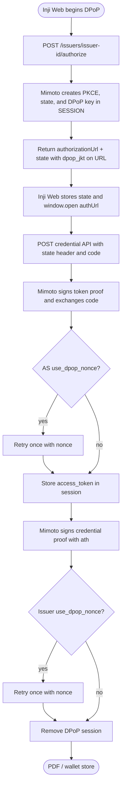
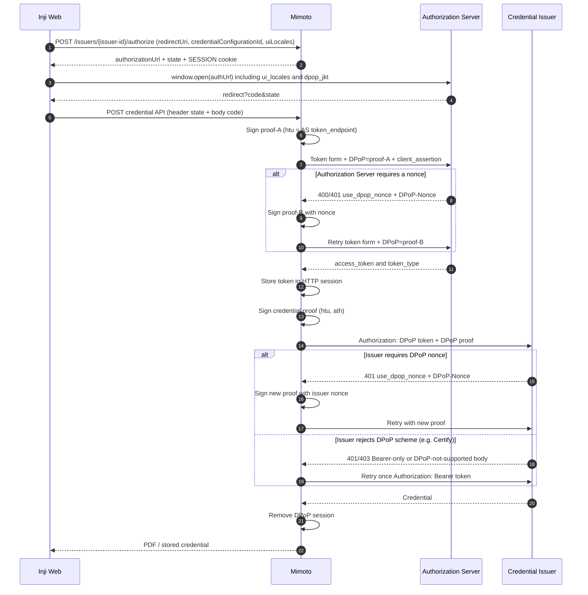
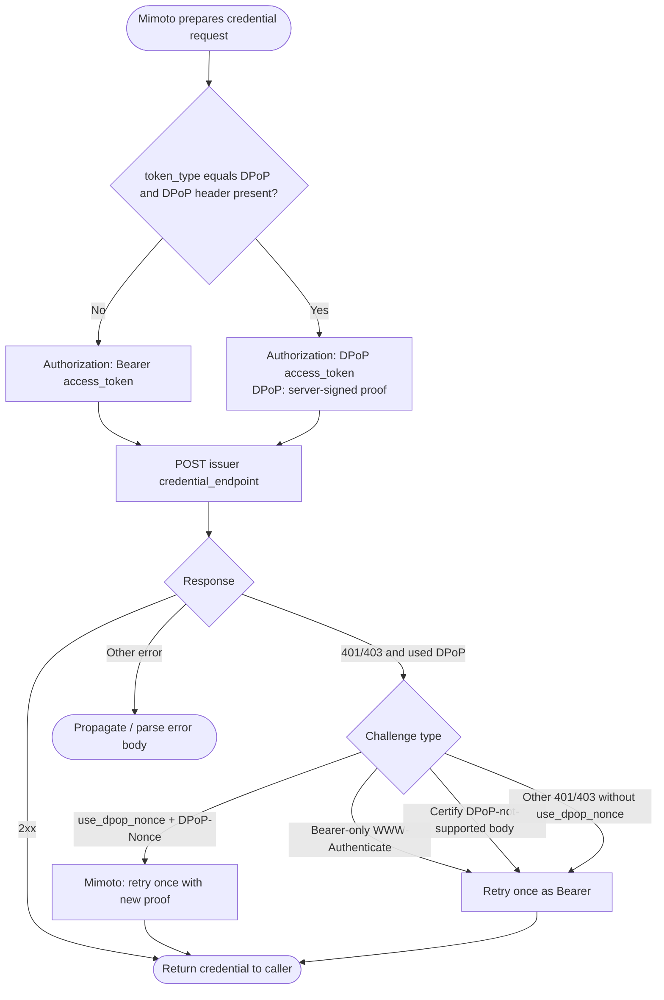
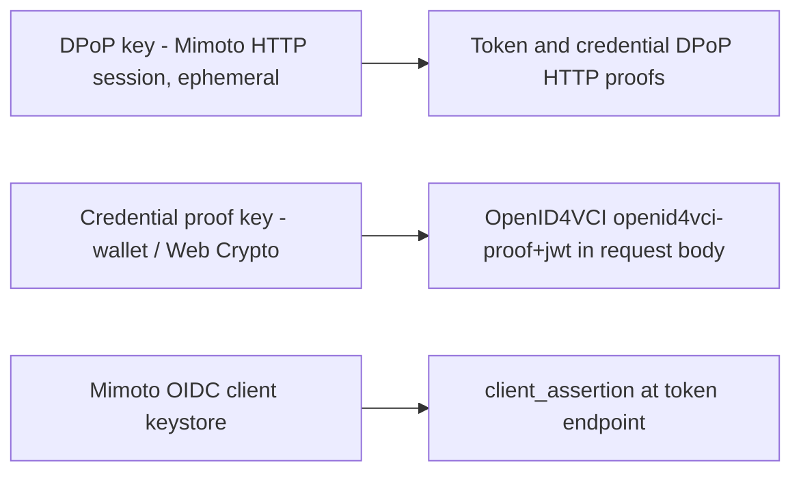

# DPoP Sender-Constrained Access Token Support

This document describes how **Mimoto** supports Demonstrating Proof of Possession (DPoP) for OpenID for Verifiable Credential Issuance (OpenID4VCI) flows used by **Inji Web**.

DPoP binds an OAuth access token to a client-held key. A client presents a request-specific DPoP proof together with the access token, preventing the token from being replayed without the corresponding private key.

Mimoto generates PKCE and OAuth `state`, creates an ephemeral DPoP key per session, signs token and credential proofs, retries `use_dpop_nonce` internally, and keeps the access token and private key in the HTTP session. Inji Web never receives the DPoP private key, the access token, or the PKCE `code_verifier`.

The implementation follows:

- [RFC 9449 - OAuth 2.0 Demonstrating Proof of Possession](https://www.rfc-editor.org/rfc/rfc9449)
- [OpenID for Verifiable Credential Issuance 1.0](https://openid.net/specs/openid-4-verifiable-credential-issuance-1_0.html)

## Supported flows

DPoP is supported for the OpenID4VCI **Authorization Code** flow through Mimoto for:

1. **Guest download** — `POST /credentials/download`
2. **Logged-in wallet store** — `POST /wallets/{walletId}/credentials`

Pre-Authorized Code Flow through Mimoto is out of scope for this delivery.

DPoP uses:

```text
POST /issuers/{issuer-id}/authorize
POST /credentials/download
POST /wallets/{walletId}/credentials
```

Inji Web does **not** call a separate token API. Download sends OAuth `state` in the `state` request header and `code` in the body. Mimoto loads the matching DPoP session (including PKCE verifier and DPoP key), exchanges the authorization code internally, then fetches the credential.

`POST /v2/get-token/{issuer}` remains as a DPoP header passthrough for non-Inji-Web clients. Inji Web does not use it.

`POST /get-token/{issuer}` remains as the Bearer-only confidential-client token proxy. It does not accept a `DPoP` header.

Credential download APIs require a DPoP session. They do not accept a client `DPoP` header or a pre-issued `access_token`.

## Design goals

- Create PKCE and OAuth `state` in Mimoto (not in the browser).
- Create a DPoP key per session in Mimoto and include `dpop_jkt` on the authorization URL returned to Inji Web.
- Bind proofs to the **real upstream** Authorization Server token endpoint and Credential Issuer credential endpoint (`htu`), not to Mimoto URLs.
- Exchange the authorization code in Mimoto and attach DPoP to the AS.
- Handle `use_dpop_nonce` inside Mimoto (no browser round-trip).
- Download the credential with a new proof that includes `ath`.
- Keep the access token, PKCE verifier, and DPoP private key server-side; never return them to the SPA.
- Bind that material to the HTTP session cookie (`SESSION`). Logged-in users already have a session; guest callers receive one from `POST /issuers/{issuer-id}/authorize`.
- Keep DPoP keys separate from OpenID4VCI credential proof keys (`openid4vci-proof+jwt`) and from Mimoto `client_assertion` keys.

## Component responsibilities

| Component | Responsibilities |
| --------- | ---------------- |
| Inji Web | Call `POST /issuers/{issuer-id}/authorize` with `redirectUri`, `credentialConfigurationId`, and `uiLocales`; store the returned `state` in browser session storage for the redirect; open the returned authorization URL (`window.open`); after redirect, send `state` as a request header plus `code` on the credential download APIs. Do not generate PKCE, and do not send tokens or DPoP proofs. |
| Mimoto | Generate OAuth `state` and PKCE; generate DPoP key; put `dpop_jkt` (and PKCE) on the authorization URL; return `authorizationUrl` and `state`; exchange the auth code during download using the stored verifier; sign token proofs; retry AS `use_dpop_nonce`; keep the access token in session; sign credential proofs with `ath`; retry issuer `use_dpop_nonce`; delete the DPoP session after download. |
| Authorization Server | Validate token-endpoint proofs, bind DPoP access tokens to the proof key, may issue `DPoP-Nonce` challenges. |
| Credential Issuer | Validate the DPoP-bound access token and credential-endpoint proof, may issue resource-server `DPoP-Nonce` challenges. Some issuers (for example Certify) may reject `Authorization: DPoP` and require Bearer. |

## Key lifecycle and algorithm selection

Mimoto owns the DPoP key lifecycle:

1. `POST /issuers/{issuer-id}/authorize` creates an HTTP session (guest) or reuses the logged-in session, generates OAuth `state` and PKCE, and builds the authorization URL.
2. Mimoto reads `dpop_signing_alg_values_supported` from Authorization Server metadata.
3. When that list is present, Mimoto uses the **first advertised algorithm it can sign** (`RS256`, `PS256`, or `ES256`). It does not apply a separate client ranking. Example: `["RS256","ES512","EdDSA","ES256K","ES256","ES384"]` → `RS256`.
4. When the metadata value is absent or empty, Mimoto defaults to **ES256**.
5. When the advertised list is non-empty but contains none of `RS256` / `PS256` / `ES256`, algorithm selection fails.
6. Mimoto generates an ephemeral JWK, stores it under session attribute `dpop_session` keyed by `state`, and includes RFC 7638 `dpop_jkt` on the returned authorization URL.
7. The same key is used for `dpop_jkt`, the token proof, and the credential proof.
8. After a successful credential download, Mimoto removes the DPoP session. The private key never leaves Mimoto.

DPoP algorithm selection is independent of OpenID4VCI credential proof algorithms and of `token_endpoint_auth_signing_alg_values_supported` (client_assertion).

## Client and Mimoto API boundary

### Authorize — `POST /issuers/{issuer-id}/authorize`

```http
POST /issuers/{issuer-id}/authorize
Content-Type: application/json

{
  "redirectUri": "https://injiweb.example.com/redirect",
  "credentialConfigurationId": "MockVerifiableCredential",
  "uiLocales": "en"
}
```

All body fields are required. Inji Web does **not** send `state`, `codeChallenge`, or `codeChallengeMethod`; Mimoto generates PKCE and OAuth `state` server-side. `uiLocales` is the Inji Web UI language and is placed on the authorization URL as `ui_locales`. `client_id`, `authorization_endpoint`, and `scope` come from issuer configuration using `credentialConfigurationId`. `response_type` is always `code`.

Response:

```json
{
  "authorizationUrl": "https://as.example.com/authorize?client_id=...&redirect_uri=...&response_type=code&scope=...&state=...&code_challenge=...&code_challenge_method=S256&ui_locales=en&dpop_jkt=...",
  "state": "<oauth-state>"
}
```

Inji Web stores `state` in its browser download session (to match the redirect and send it again on download), then opens `authorizationUrl` (`window.open(authUrl)`). Guest callers receive a `SESSION` cookie. Subsequent download calls must send credentials (`withCredentials: true`).

### Guest credential — `POST /credentials/download`

```http
POST /credentials/download
Content-Type: application/x-www-form-urlencoded
state: <oauth-state>

issuer=...
&credential=...
&vcStorageExpiryLimitInTimes=...
&code=...
```

When a DPoP session exists for `state`, Mimoto:

1. Loads the stored PKCE verifier and DPoP key for that `state`.
2. Builds the confidential-client token request (`client_assertion`, etc.).
3. Signs a DPoP proof with `htu` = the real AS `token_endpoint`.
4. POSTs to `getTokenEndpoint()` (`proxy_token_endpoint` when configured).
5. On `use_dpop_nonce` + `DPoP-Nonce`, signs a new proof with `nonce` and retries once. MOSIP XML `<OAuthError>` bodies are treated as JSON `error` values.
6. Stores `access_token` / `token_type` / `c_nonce` in the session (never returned to the SPA).
7. Signs a credential proof (`htu` = credential endpoint, `ath` = SHA-256 of the access token).
8. Retries issuer `use_dpop_nonce` once, then removes the DPoP session.

Do not send `access_token`, `code_verifier`, `grant_type`, `redirect_uri`, or a `DPoP` header from Inji Web. Mimoto supplies grant and PKCE details from the DPoP session.

### Logged-in credential — `POST /wallets/{walletId}/credentials`

```http
POST /wallets/{walletId}/credentials
Content-Type: application/json
Accept-Language: <ui-locale>
state: <oauth-state>

{
  "issuer": "...",
  "credentialConfigurationId": "...",
  "code": "..."
}
```

Same server-side token exchange + proof + nonce retry as guest. The logged-in `SESSION` cookie already binds the user. Do not send `accessToken`, `codeVerifier`, `grantType`, `redirectUri`, or a `DPoP` header from Inji Web.

## DPoP proof contents (Mimoto-built)

Each request receives a newly signed proof with a unique `jti`.

| Claim or header | Token endpoint proof | Credential endpoint proof |
| --------------- | -------------------- | ------------------------- |
| `typ` | `dpop+jwt` | `dpop+jwt` |
| `alg` | Selected asymmetric algorithm | Same algorithm for the flow |
| `jwk` | Public DPoP key | Same public DPoP key |
| `jti` | New value for every proof | New value for every proof and retry |
| `htm` | `POST` | `POST` |
| `htu` | Real AS token endpoint | Real issuer credential endpoint |
| `iat` / `exp` | 60-second window | 60-second window |
| `nonce` | After AS challenge | After issuer challenge |
| `ath` | Not included | Base64url SHA-256 of the access token |

`htu` is normalized without query or fragment. Only the public key appears in the proof header.

## Flow diagrams

### Flow 1 - DPoP



### Flow 2 - Combined token exchange and credential download



### Flow 3 - Credential endpoint processing inside Mimoto



## Key separation



DPoP keys, OpenID4VCI credential proof keys, and Mimoto `client_assertion` keys are always separate.

## Credential request and `token_type`

| Token response | Mimoto credential request behavior |
| -------------- | ---------------------------------- |
| `token_type: DPoP` and `DPoP` header present | `Authorization: DPoP <access-token>` and attach the DPoP proof. |
| `token_type: Bearer`, another value, missing type, or missing `DPoP` header | `Authorization: Bearer <access-token>` without a DPoP proof. |

## Nonce handling

`c_nonce` and `DPoP-Nonce` serve different purposes:

- `c_nonce` is used by the OpenID4VCI credential proof of possession in the request body.
- `DPoP-Nonce` is used by DPoP proofs in HTTP headers.

### Authorization Server nonce

1. Mimoto sends the first token proof to the AS.
2. On `use_dpop_nonce` with `DPoP-Nonce`, Mimoto rebuilds the proof and retries the AS once.
3. Inji Web does not see this challenge.

### Credential Issuer nonce

1. Mimoto sends a credential-endpoint proof.
2. On issuer `401` with `use_dpop_nonce` and `DPoP-Nonce`, Mimoto rebuilds the proof and retries the issuer once.
3. If the Mimoto retry is exhausted, Mimoto returns an error. The browser never retries DPoP.
4. Authorization Server and Credential Issuer DPoP nonces are not interchangeable.

## Bearer fallback behavior

For an access token used with `token_type: DPoP`, Mimoto applies this credential-endpoint policy:

1. A DPoP `use_dpop_nonce` challenge with a nonce is **not** Bearer-downgraded; Mimoto retries with a new proof.
2. A challenge that advertises only `Bearer` (no DPoP scheme) is retried once using `Authorization: Bearer` without a `DPoP` header (RFC 9449 §7.2).
3. A response body matching Certify’s message `DPoP tokens are not supported. Use a Bearer token.` triggers the same one-time Bearer retry.
4. Other `401` / `403` responses after `Authorization: DPoP` that are **not** `use_dpop_nonce` challenges also trigger one Bearer retry (compatibility for issuers that omit `WWW-Authenticate`).
5. Other failures are propagated without retry.

The Bearer-only retry is intentional compatibility behavior and is logged as a warning.

## Error handling

| Scenario | Behavior |
| -------- | -------- |
| Token AS returns `use_dpop_nonce` (DPoP session) | Retry once inside Mimoto during download; SPA never sees the challenge. |
| Credential issuer returns `use_dpop_nonce` + `DPoP-Nonce` (DPoP session) | Retry once inside Mimoto; then remove the DPoP session on success. |
| Credential issuer returns Bearer-only `WWW-Authenticate` | Retry once as Bearer. |
| Credential issuer returns Certify DPoP-not-supported body | Retry once as Bearer. |
| Logged-in API called without `state` header or without the authorization code | `400 invalid_request`. |
| Guest/logged-in called with DPoP `state` + auth `code` | Exchange the code internally using the session PKCE verifier, then download. |

## Security characteristics

- The private DPoP key and PKCE verifier exist only in Mimoto, bound to the HTTP session and OAuth `state`.
- Combined download returns only the PDF / stored credential.
- Proof `htu` values target upstream resource URLs so token binding remains correct across the proxy.
- Credential-endpoint proofs include `ath`, binding the proof to the access token.
- Each proof uses a fresh `jti` and a 60-second validity window.
- DPoP keys remain separate from credential proof keys and from Mimoto client assertion keys.
- Guest DPoP relies on the `SESSION` cookie from `POST /issuers/{issuer-id}/authorize`. Cross-origin deployments must send credentials on every DPoP call.

## Client contract summary (Inji Web)

1. `POST /issuers/{issuer-id}/authorize` with `redirectUri`, `credentialConfigurationId`, and `uiLocales`, and credentials included.
2. Persist the returned `state` in the browser download session; open the returned `authorizationUrl`.
3. Guest: `POST /credentials/download` with `state` in the request header and `issuer`, `credential`, `vcStorageExpiryLimitInTimes`, and `code` in the form body. Do not send `access_token`, `code_verifier`, or `DPoP`.
4. Logged-in: `POST /wallets/{walletId}/credentials` with `state` in the request header and `issuer`, `credentialConfigurationId`, and `code` in the JSON body. Do not send `accessToken`, `codeVerifier`, or `DPoP`.
5. Expect Mimoto to exchange the token internally (using session PKCE), retry AS and issuer `use_dpop_nonce`, and auto-retry Bearer for Certify-like DPoP rejections.

## Out of scope

- PKCE / OAuth `state` generation in the browser for Inji Web
- DPoP key generation or proof signing in the browser for Inji Web
- DPoP for OpenID4VP presentation flows
- DPoP for wallet-binding / local authentication endpoints
- Refresh-token flows
- Persistent DPoP keys outside the HTTP session
- Pre-Authorized Code Flow through Mimoto
