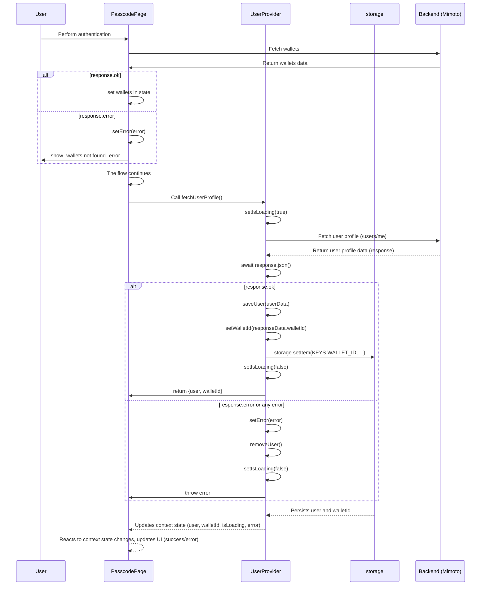
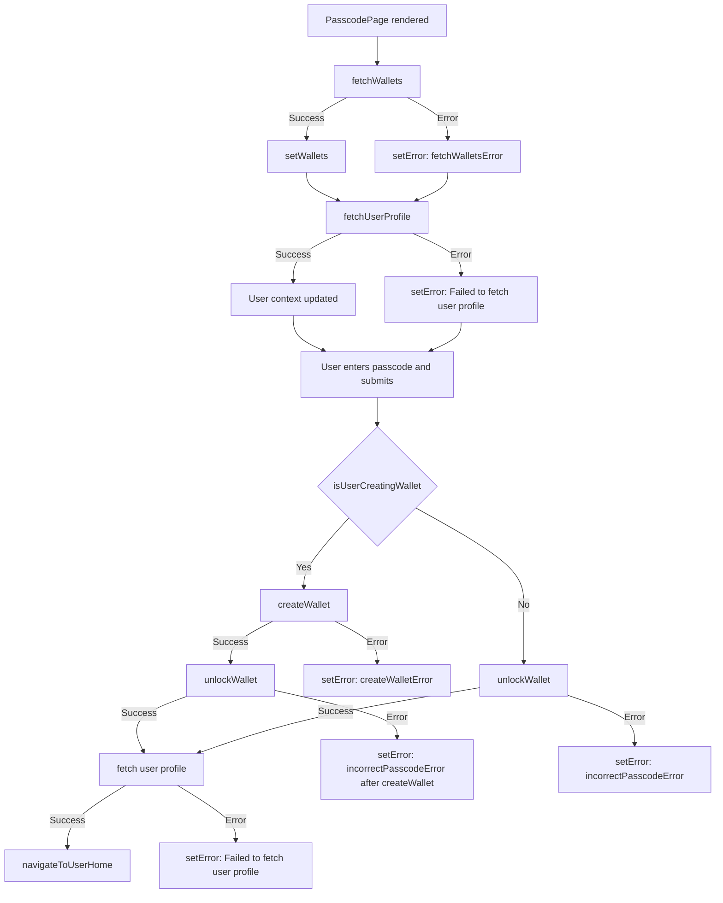
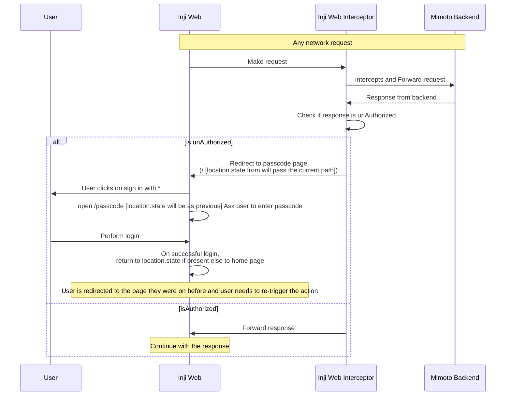

Login flow in FE

```mermaid
sequenceDiagram
    participant User
    participant PasscodePage
    participant UserProvider
    participant storage
    participant be as Backend (Mimoto)
    User ->> PasscodePage: Perform authentication
    PasscodePage ->> be: Fetch wallets
    be ->> PasscodePage: Return wallets data
    alt response.ok
        PasscodePage ->> PasscodePage: set wallets in state
    else response.error
        PasscodePage ->> PasscodePage: setError(error)
        PasscodePage ->> User: show "wallets not found" error
    end
    PasscodePage ->> PasscodePage: The flow continues
    PasscodePage ->> UserProvider: Call fetchUserProfile()
    UserProvider ->> UserProvider: setIsLoading(true)
    UserProvider ->> be: Fetch user profile (/users/me)
    be -->> UserProvider: Return user profile data (response)
    UserProvider ->> UserProvider: await response.json()

    alt response.ok
        UserProvider ->> UserProvider: saveUser(userData)
        UserProvider ->> UserProvider: setWalletId(responseData.walletId)
        UserProvider ->> storage: storage.setItem(KEYS.WALLET_ID, ...)
        UserProvider ->> UserProvider: setIsLoading(false)
        UserProvider ->> PasscodePage: return {user, walletId}
    else response.error or any error
        UserProvider ->> UserProvider: setError(error)
        UserProvider ->> UserProvider: removeUser()
        UserProvider ->> UserProvider: setIsLoading(false)
        UserProvider ->> PasscodePage: throw error
    end

    storage -->> UserProvider: Persists user and walletId
    UserProvider -->> PasscodePage: Updates context state (user, walletId, isLoading, error)
    PasscodePage -->> PasscodePage: Reacts to context state changes, updates UI (success/error)
```

Flow of passcode page

```mermaid
flowchart TD
            A[PasscodePage rendered] --> B[fetchWallets]
            B -->|Success| C[setWallets]
            B -->|Error| D[setError: fetchWalletsError]
            C --> E[fetchUserProfile]
            D --> E
            E -->|Success| F[User context updated]
            E -->|Error| G[setError: Failed to fetch user profile]
            F --> H[User enters passcode and submits]
            G --> H
            H --> I{isUserCreatingWallet}
            I -- Yes --> J[createWallet]
            J -->|Success| K[unlockWallet]
            J -->|Error| L[setError: createWalletError]
            K -->|Success| M[fetch user profile]
            K -->|Error| R[setError: incorrectPasscodeError after createWallet]
            I -- No --> N[unlockWallet]
            N -->|Success| M
            N -->|Error| O[setError: incorrectPasscodeError]
            M -->|Success| P[navigateToUserHome]
            M -->|Error| Q[setError: Failed to fetch user profile]
```

Flow of API interactions

```mermaid
sequenceDiagram
    participant user as User
    participant fe as Inji Web
    participant interceptor as Inji Web Interceptor
    participant be as Mimoto Backend
    Note over fe, be: Any network request
    fe ->> interceptor: Make request
    interceptor ->> be: intercepts and Forward request
    be -->> interceptor: Response from backend
    interceptor ->> interceptor: Check if response is unAuthorized
    alt is unAuthorized
        interceptor ->> fe: Redirect to passcode page <br/>(/ [location.state from will pass the current path])
        fe ->> user: User clicks on sign in with *
        fe ->> fe: open /passcode [location.state will be as previous] Ask user to enter passcode
        user ->> fe: Perform login
        fe ->> fe: On successful login, <br/>return to location.state if present else to home page
        note over fe: User is redirected to the page they were on before and user needs to re-trigger the action
    else isAuthorized
        interceptor ->> fe: Forward response
        Note over fe: Continue with the response
    end
```